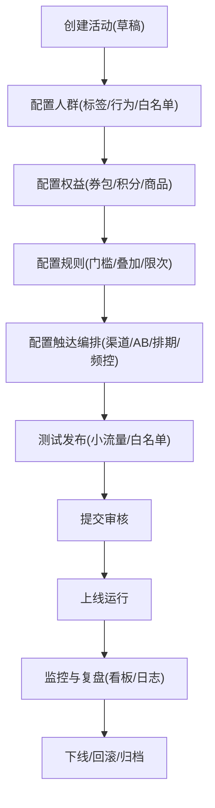

# 运营工具配置平台 PRD

## 1. 产品概述
面向运营/增长团队的一体化配置平台，用于「圈人-配权益-配规则-编排触达-监控复盘」的全流程落地与治理。
- 解决配置分散、规则难以复用、变更不可追溯、效果难以闭环的问题
- 目标价值：降低活动搭建成本、提升触达精度与稳定性、强化审计合规与可观测性

## 2. 核心功能

### 2.1 用户角色
| 角色 | 登录方式 | 核心权限 |
|------|----------|----------|
| 运营（Operator） | 企业账号/SSO（后续） | 新建/编辑活动与配置、发起测试、提交上线 |
| 审核（Approver） | 企业账号/SSO（后续） | 审核上线、下线、紧急回滚 |
| 管理员（Admin） | 企业账号/SSO（后续） | 权限管理、字典配置、渠道与模板管理 |
| 分析（Analyst） | 企业账号/SSO（后续） | 看板查看、导出报表（只读） |

### 2.2 功能模块
1. **活动工作台**：活动列表、生命周期、快速复制、测试与发布
2. **人群圈选系统**：标签筛选、行为筛选、白名单管理（Excel 导入/手动输入）
3. **权益配置中心**：券包、积分规则、实物/虚拟商品等权益库与发放策略
4. **规则引擎系统**：门槛/叠加/限次规则，可视化条件组合与校验
5. **触达编排系统**：站内信/短信/IM，多分支编排、AB 测试、定时与频控
6. **状态与历史管理**：操作审计、变更对比、配置快照、效果数据看板

### 2.3 页面与模块明细
| 页面名称 | 模块名称 | 功能描述 |
|---------|----------|----------|
| 登录/鉴权 | 登录态/权限 | 登录、角色鉴权、菜单与路由权限控制 |
| 活动列表 | 列表与筛选 | 草稿/测试/上线/下线筛选、创建、复制、归档 |
| 活动详情（总览） | 配置摘要 | 展示人群/规则/权益/触达摘要、最近变更与风险提示 |
| 人群圈选 | 标签筛选 | 多标签组合（AND/OR/NOT）、分组与括号、预估人数 |
| 人群圈选 | 行为筛选 | 事件选择、时间窗、次数/属性过滤、去重口径设置 |
| 人群圈选 | 白名单管理 | Excel 导入、手动输入、去重与校验、版本化保存 |
| 权益中心 | 券包管理 | 创建/编辑券包、券组合、有效期、库存、发放策略 |
| 权益中心 | 积分规则 | 获取/消耗规则、上限、有效期、冲突检测 |
| 权益中心 | 其他权益 | 实物/虚拟商品配置、库存/兑换码管理（MVP 简化） |
| 规则引擎 | 可视化规则编辑器 | 门槛/叠加/限次规则、复杂条件组合、实时校验与预览 |
| 触达编排 | 渠道配置 | 站内信/短信/IM 通道选择、模板选择、变量映射 |
| 触达编排 | AB 测试 | 分流比例、对照组、指标定义、版本管理 |
| 触达编排 | 发送控制 | 发送时间窗、排期、频次限制、黑名单（可选） |
| 历史与审计 | 操作日志 | 谁在何时修改了什么、变更 diff、回滚到快照 |
| 数据看板 | 效果概览 | 参与率、转化率、券核销、触达成功率、分组对比 |

## 3. 核心流程
### 3.1 主流程（运营搭建活动）
1) 创建活动（草稿）  
2) 配置人群（标签/行为/白名单）并预估人数  
3) 配置权益（券包/积分/商品）与发放策略  
4) 配置规则（门槛/叠加/限次）并完成校验  
5) 配置触达编排（渠道、模板、变量、AB、排期、频控）  
6) 发起测试（小流量/白名单）  
7) 提交审核并上线  
8) 监控运行状态与指标，必要时下线/回滚  

### 3.2 可视化规则编辑交互（关键）
- 以「条件组」为基本单位：组内 AND、组间 OR，支持 NOT 与括号嵌套（MVP 支持两层）
- 每个条件具备：字段、运算符、值、数据类型、校验提示
- 提供「规则预览」：输出 JSON 结构与自然语言描述
- 提供「冲突检测」：限次与叠加矛盾、门槛与权益发放策略矛盾等

## 4. 用户界面设计
### 4.1 设计风格（桌面优先）
- 视觉方向：深色石墨底 + 荧光青/琥珀作为状态强调色，信息密度高但层次清晰
- 字体：中文优先使用系统字体栈，标题更紧凑、正文更易读（后续可接入企业字体）
- 组件形态：分区卡片 + 侧边栏导航；大量使用表格/筛选/抽屉/对话框
- 反馈：保存/校验/发布动作提供明确状态（loading、success、error）与可追溯提示
- 规则编辑器：节点式/表单式混合（左侧条件树 + 右侧属性面板 + 顶部自然语言摘要）

### 4.2 页面设计概览
| 页面名称 | 模块名称 | UI 要素 |
|---------|----------|---------|
| 活动详情 | 配置摘要 | 多段摘要卡片、风险徽标、关键动作按钮（测试/提交/上线/下线） |
| 人群圈选 | 条件构建区 | 条件行、分组、括号、字段搜索、人数预估与抽样预览 |
| 规则引擎 | 规则编辑器 | 条件树、拖拽排序（可选）、校验提示、自然语言摘要、JSON 预览 |
| 触达编排 | 编排画布 | 步骤条/泳道、分支（AB）、时间与频控配置面板 |
| 审计日志 | Diff 视图 | 配置快照对比、字段级变更高亮、回滚按钮与二次确认 |

### 4.3 响应式
- 桌面优先；中等宽度折叠右侧属性面板；移动端以只读看板为主（MVP 可降级）

## 5. 非功能需求（MVP）
- 权限：RBAC，至少覆盖页面与关键动作（发布/下线/回滚）
- 审计：所有变更写入操作日志，保存配置快照（可回滚）
- 可靠性：发布前校验必过；上线配置只读；下线可立即生效
- 可观测：关键任务状态、触达成功率、错误原因分布
- 导入：白名单 Excel 导入支持去重、格式校验、错误行提示与回滚

