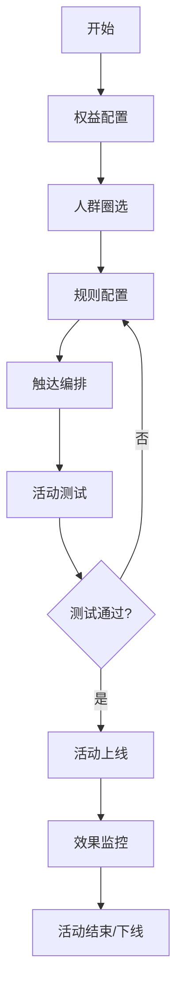

# 产品需求文档 (PRD)

## 1. 产品概述
本平台是一个一站式运营工具配置平台，旨在帮助运营人员高效地进行用户触达和权益管理。
平台整合了人群圈选、权益配置、规则引擎、触达编排及全链路状态监控等核心功能，支持复杂的运营策略落地。

## 2. 核心功能

### 2.1 用户角色
| 角色 | 注册方式 | 核心权限 |
|------|----------|----------|
| 运营管理员 | 系统预置/后台创建 | 全局配置权限，包括人群、权益、规则、触达及监控 |
| 运营专员 | 邀请/后台创建 | 活动创建与执行，查看报表 |

### 2.2 功能模块
1. **工作台 (Dashboard)**: 核心数据概览、快捷入口、待办事项。
2. **人群圈选 (Audience)**: 标签筛选、行为筛选、白名单管理。
3. **权益中心 (Rights)**: 优惠券、积分规则、实物/虚拟商品配置。
4. **规则引擎 (Rules)**: 可视化规则配置（门槛、叠加、限次）。
5. **触达编排 (Touchpoint)**: 站内信、短信、IM 消息配置及 A/B 测试。
6. **活动管理 (Campaign)**: 活动全生命周期管理及效果监控。

### 2.3 页面详情
| 页面名称 | 模块名称 | 功能描述 |
|----------|----------|----------|
| 工作台 | 数据概览 | 展示今日触达人数、权益发放量、核销率等关键指标。 |
| 人群圈选列表 | 筛选器 | 支持按标签（性别/年龄/地域）、行为（浏览/点击/购买）组合筛选用户。 |
| 人群圈选详情 | 白名单导入 | 支持 Excel 批量导入用户 ID，支持手动输入。 |
| 权益管理 | 权益配置 | 创建/编辑优惠券（面额、有效期）、积分规则（获取/消耗）、商品库管理。 |
| 规则引擎 | 规则画布 | 可视化拖拽或表单配置规则：消费门槛、活动叠加逻辑、用户参与次数限制。 |
| 触达编排 | 渠道配置 | 配置站内信内容、短信模板、IM 消息；设置发送时间、频次限制。 |
| 触达编排 | A/B 测试 | 配置不同策略组，分配流量比例。 |
| 活动管理 | 状态流转 | 管理活动状态（草稿/测试/上线/下线）；查看操作日志。 |
| 数据看板 | 效果分析 | 展示活动参与率、转化率、ROI 等详细报表。 |

## 3. 核心流程
### 活动配置与执行流程
运营人员首先在权益中心配置好奖品，接着在人群圈选模块筛选目标用户。
然后进入规则引擎设定参与门槛和限制。
随后在触达编排中选择渠道和发送策略。
最后在活动管理中将活动上线，并实时监控效果。

## 4. 用户界面设计
### 4.1 设计风格
- **主色调**: 科技蓝/深邃蓝 (体现专业与稳定)，搭配活力橙/绿作为状态指示。
- **字体**: 系统默认无衬线字体 (如 Inter, Roboto, PingFang SC)，保证清晰易读。
- **布局**: 左侧侧边栏导航，顶部通栏，中间内容区域卡片式布局。
- **组件风格**: 扁平化设计，轻微阴影增加层次感，圆角适中 (4px-8px)。

### 4.2 页面设计概览
| 页面名称 | 模块名称 | UI 元素 |
|----------|----------|---------|
| 全局 | 导航栏 | 左侧垂直导航，包含图标和文字；顶部包含用户信息和面包屑。 |
| 规则引擎 | 规则配置器 | 流程图式或积木式可视化配置界面，清晰展示逻辑关系。 |
| 数据看板 | 图表组件 | 使用折线图、柱状图、饼图展示数据，支持时间范围筛选。 |

### 4.3 响应式设计
- **桌面优先**: 针对大屏优化，支持复杂配置操作。
- **适配**: 最小兼容 1024px 宽度，移动端主要用于查看数据和简单审批。
