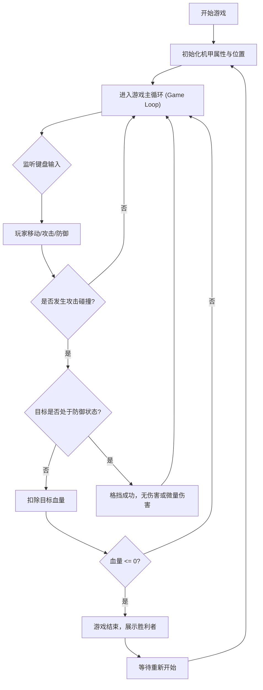

# 1. 产品概述
这是一款简单且充满复古风格的像素机甲对战小游戏。
- 游戏主打本地双人对战，玩家将分别控制两台各具特色的像素机甲进行决斗。游戏解决了在网页端快速体验对战游戏乐趣的需求。
- 目标用户为复古游戏爱好者和休闲玩家，游戏通过简单的移动、攻击、防御操作，配合直观的血量条和胜负判定，带来快速而紧张的对战体验。

# 2. 核心功能

### 2.1 角色设计
| 角色 | 操作方式 | 核心技能与属性 |
|------|----------|----------------|
| 机甲一号 (玩家1) | W/A/S/D 移动，F 攻击，G 防御 | 基础血量 100，近战攻击，带受击与攻击动画 |
| 机甲二号 (玩家2) | 方向键 移动，K 攻击，L 防御 | 基础血量 100，近战攻击，带受击与攻击动画 |

### 2.2 功能模块
1. **游戏主场景**: 复古像素风格的对战擂台背景，血量UI展示。
2. **机甲控制系统**: 移动限制（不超出边界）、攻击碰撞检测、防御状态判定。
3. **胜负判定系统**: 血量扣除逻辑，游戏结束状态展示与重新开始功能。

### 2.3 页面详情
| 页面名称 | 模块名称 | 功能描述 |
|----------|----------|----------|
| 对战主界面 | 场景渲染 | 使用 Canvas 或 DOM 渲染像素化背景和地面 |
| 对战主界面 | 角色渲染 | 根据状态（站立、移动、攻击、防御、受击）切换不同的像素动画帧 |
| 对战主界面 | UI系统 | 顶部显示两位玩家的生命值（HP条）及游戏倒计时或提示语 |
| 结算界面 | 游戏结束 | 当一方血量归零时，弹出大字体的胜负结果及“再来一局”按钮 |

# 3. 核心流程
两位玩家进入页面 -> 倒计时 3, 2, 1 开始 -> 玩家通过键盘操作机甲 -> 发生碰撞且一方攻击命中 -> 扣除另一方血量（若未防御） -> 某一方血量归零 -> 游戏结束并展示胜方 -> 点击重新开始重置游戏。

# 4. 用户界面设计
### 4.1 设计风格
- **主色调**: 复古像素色板（如赛博朋克霓虹色、或经典的 FC 8位机色彩：深蓝、品红、亮绿）。
- **按钮样式**: 带有厚重像素边框的 3D 悬浮按钮，按下时有明显的下陷反馈。
- **字体与大小**: 使用像素风格字体（如 'Press Start 2P' 或系统等宽字体模拟），标题字号巨大且醒目。
- **布局风格**: 街机对战游戏经典布局（左右两侧各一条粗大的血量条，中间为 Timer 或 K.O. 提示）。
- **动画建议**: 使用 CSS 帧动画或 Canvas sprite 切换，强调打击感（屏幕震动、像素粒子飞溅）。

### 4.2 页面设计概览
| 页面名称 | 模块名称 | UI 元素 |
|----------|----------|---------|
| 对战主界面 | 顶部状态栏 | 左侧红/蓝渐变血量条(P1)，右侧红/蓝渐变血量条(P2)，居中像素风格 K.O. 标志 |
| 对战主界面 | 游戏画面 | 像素风城市废墟背景，带有一点视差滚动的云层或远景 |
| 结算界面 | 弹窗覆盖层 | 半透明黑色背景，闪烁的 "PLAYER 1 WINS!" 文本，以及像素边框的 "RESTART" 按钮 |

### 4.3 响应式设计
- 主要面向桌面端游玩（需要实体键盘），网页布局保持居中且自适应屏幕缩放，保留固定宽高比的对战区域（例如 800x600 的 Canvas）。移动端可考虑增加虚拟摇杆，但本次核心实现以键盘为主。