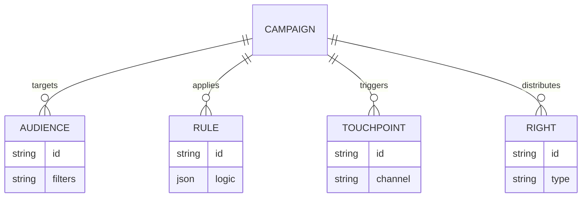

# 技术架构文档

## 1. 架构设计
本系统采用现代前端技术栈构建，专注于高性能交互与可视化配置体验。
虽然目前主要侧重前端实现，但设计上预留了与后端 API 对接的能力。

```mermaid
graph TD
    User[用户] --> Frontend[前端应用 (React)]
    Frontend --> State[状态管理 (Zustand)]
    Frontend --> Router[路由 (React Router)]
    Frontend --> Components[UI 组件库 (Shadcn UI / Tailwind)]
    Frontend --> Visual[可视化引擎 (React Flow)]
    Frontend --> MockAPI[模拟 API 服务]
    MockAPI --> LocalStorage[浏览器本地存储]
```

## 2. 技术说明
- **前端框架**: React 18 + TypeScript + Vite
- **样式方案**: Tailwind CSS 3
- **状态管理**: Zustand (轻量级，适合复杂交互状态)
- **路由管理**: React Router 6
- **可视化库**: React Flow (用于规则引擎配置)、Recharts (用于数据看板)
- **图标库**: Lucide React
- **工具链**: Vite, ESLint, Prettier

## 3. 路由定义
| 路由 | 用途 |
|------|------|
| / | 仪表盘 (Dashboard) |
| /audience | 人群圈选列表 |
| /audience/create | 新建人群圈选 |
| /rights | 权益管理列表 |
| /rights/create | 新建权益 |
| /rules | 规则引擎配置列表 |
| /rules/editor/:id | 规则可视化编辑器 |
| /touchpoint | 触达编排列表 |
| /campaigns | 活动全生命周期管理 |

## 4. API 定义 (模拟)
```typescript
// 用户类型
interface User {
  id: string;
  name: string;
  role: 'admin' | 'operator';
}

// 权益类型
interface Right {
  id: string;
  name: string;
  type: 'coupon' | 'points' | 'goods';
  config: any;
}

// 规则类型
interface Rule {
  id: string;
  name: string;
  conditions: any[]; // 复杂逻辑结构
}

// 触达任务
interface Touchpoint {
  id: string;
  channel: 'sms' | 'im' | 'inapp';
  content: string;
  schedule: string;
}

// 活动
interface Campaign {
  id: string;
  name: string;
  status: 'draft' | 'testing' | 'online' | 'offline';
  audienceId: string;
  ruleId: string;
  touchpointId: string;
  metrics?: {
    participants: number;
    conversion: number;
  };
}
```

## 5. 数据模型 (前端模拟)
### 5.1 数据实体关系

