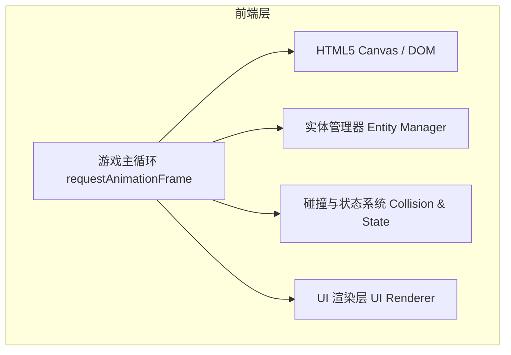
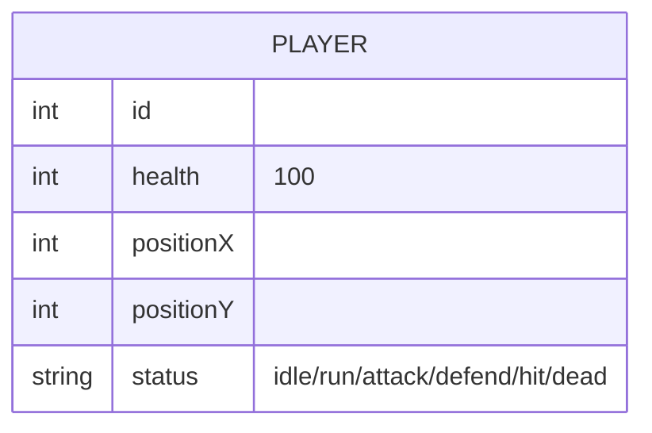

# 1. 架构设计


# 2. 技术描述
- **前端技术栈**: HTML5 + 原生 JavaScript (ES6) + CSS3
- **渲染方案**: Canvas 2D API 绘制像素级角色及场景（或 CSS Sprite 动画），无需庞大的外部框架。
- **状态管理**: 基于简单对象状态机（State Machine: Idle, Run, Attack, Defend, Hit, Dead）。
- **初始化工具**: 无（纯静态页面，通过 `index.html` + `script.js` + `style.css` 组成）。
- **设计风格**: 纯前端实现复古像素画风，通过 CSS `image-rendering: pixelated;` 和自定义像素字模实现。

# 3. 路由定义
- 本项目为单页应用（SPA）形式的小游戏，无复杂的路由系统。
| 页面/状态 | 目的 |
|-----------|------|
| / | 游戏主界面，承载启动、对战、结算等全流程状态。 |

# 4. 核心系统定义
## 4.1 游戏循环与输入 (Input & Loop)
```javascript
// 核心状态机及按键映射
const keys = {
  a: false, d: false, w: false, f: false, g: false,
  ArrowLeft: false, ArrowRight: false, ArrowUp: false, k: false, l: false
};
```
## 4.2 角色类 (Sprite/Fighter)
- `position`: { x, y }
- `velocity`: { x, y }
- `height`: Number, `width`: Number
- `health`: Number (0-100)
- `isAttacking`: Boolean
- `isDefending`: Boolean
- `attackBox`: { position: { x, y }, width, height }
- `switchSprite(sprite)`: 根据状态切换动画帧 (如闲置、奔跑、攻击等)
- `takeHit()`: 受击判断与减血逻辑

## 4.3 碰撞检测系统
```javascript
function rectangularCollision({ rectangle1, rectangle2 }) {
  return (
    rectangle1.attackBox.position.x + rectangle1.attackBox.width >= rectangle2.position.x &&
    rectangle1.attackBox.position.x <= rectangle2.position.x + rectangle2.width &&
    rectangle1.attackBox.position.y + rectangle1.attackBox.height >= rectangle2.position.y &&
    rectangle1.attackBox.position.y <= rectangle2.position.y + rectangle2.height
  )
}
```

# 5. 素材方案
本项目不需要依赖外部图片，素材将采用代码生成（Canvas API 绘制简单的像素块拼成的机甲造型，或使用 Data URI 嵌入极简的 8x8/16x16 像素机甲图形）以保证独立可运行且符合“像素风”特征。
- **机甲一号（红方）**: 红色主色调方块，配有黄色的能量剑（攻击时伸出）。
- **机甲二号（蓝方）**: 蓝色主色调方块，配有白色的等离子盾（防御时展开）。
- **背景**: 深色赛博朋克风渐变背景与发光地板。

# 6. 数据模型
（本游戏为纯前端本地对战游戏，无后端及数据库）
