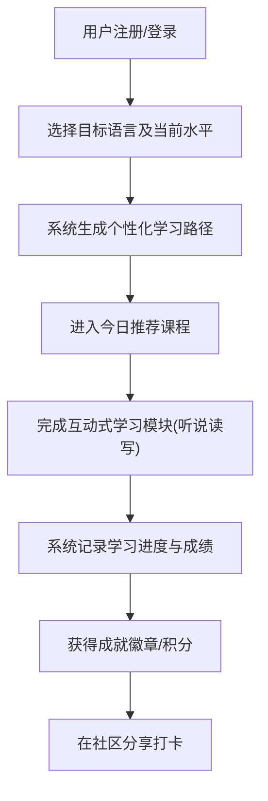

# 产品需求文档 (PRD)

## 1. 产品概述
本项目是一款支持多语种（英语、日语、韩语等主流语言）学习的在线教育平台。
旨在为用户提供沉浸式的语言学习体验，通过分级课程、互动模块和个性化推荐，帮助用户高效掌握外语并保持学习动力。

## 2. 核心功能

### 2.1 用户角色
| 角色 | 注册方式 | 核心权限 |
|------|---------------------|------------------|
| 普通学习者 | 邮箱/手机号注册 | 浏览课程、参与互动学习、记录进度、社区发帖 |
| 管理员 | 后台添加 | 管理课程内容、管理用户、处理社区举报 |

### 2.2 功能模块
1. **认证模块**：用户注册、登录、找回密码
2. **主页与仪表盘**：展示当前学习进度、个性化学习路径推荐、今日任务
3. **分级课程体系**：按语言类型（英/日/韩）和难度（初/中/高级）划分的课程列表与详情
4. **互动式学习模块**：
   - 单词记忆（闪卡、拼写）
   - 语法练习（填空、选择）
   - 口语跟读（录音对比评分）
   - 听力训练（听写、选择）
5. **学习进度追踪**：学习时长统计、掌握词汇量、能力雷达图
6. **社区与激励系统**：语种交流论坛、学习打卡、成就徽章展示、排行榜

### 2.3 页面详情
| 页面名称 | 模块名称 | 功能描述 |
|-----------|-------------|---------------------|
| 登录/注册页 | 认证表单 | 提供用户身份验证和新用户注册 |
| 学习仪表盘 | 概览模块 | 展示用户的学习雷达图、进度条、推荐的下一步课程 |
| 选课中心 | 课程大厅 | 语言切换卡片、分级课程列表、课程搜索与过滤 |
| 学习详情页 | 互动组件 | 根据当前环节提供对应的互动练习（听、说、读、写） |
| 社区广场 | 动态与排行 | 用户学习动态分享、多语种交流板块、积分排行榜 |

## 3. 核心流程
用户从注册到完成一次学习并获得奖励的核心流程。

## 4. 用户界面设计

### 4.1 设计风格
- **主色调**：知性蓝 (Blue) 或 活力绿 (Green)，传递专业与生机。
- **辅助色**：柔和的米白色或浅灰作为背景，减少长期学习的视觉疲劳。
- **组件样式**：现代卡片式布局，微圆角（Rounded-xl），轻微的悬浮阴影（Soft shadow）带来层次感。
- **字体**：使用现代无衬线字体（如 Inter 或 Roboto），保障多语种字符的清晰易读。
- **交互动效**：答题正确时的微动画反馈、页面切换的平滑过渡，增强“沉浸感”。

### 4.2 页面设计概览
| 页面名称 | 模块名称 | UI 元素 |
|-----------|-------------|-------------|
| 学习仪表盘 | 数据面板 | 环形进度条、能力雷达图、毛玻璃效果的数据卡片 |
| 互动学习页 | 练习卡片 | 大字号题目展示、清晰的操作按钮、录音波形动画 |
| 社区广场 | 动态流 | 瀑布流/列表布局、点赞/评论图标、用户头像与徽章标识 |

### 4.3 响应式设计
- **桌面端优先**，充分利用大屏空间展示课程目录与学习区。
- **移动端适配**，针对互动学习（特别是跟读和单词记忆）进行触控优化，按钮需易于点击。
