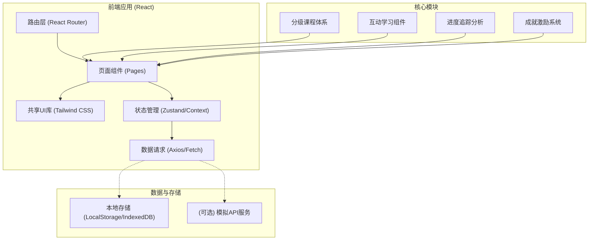
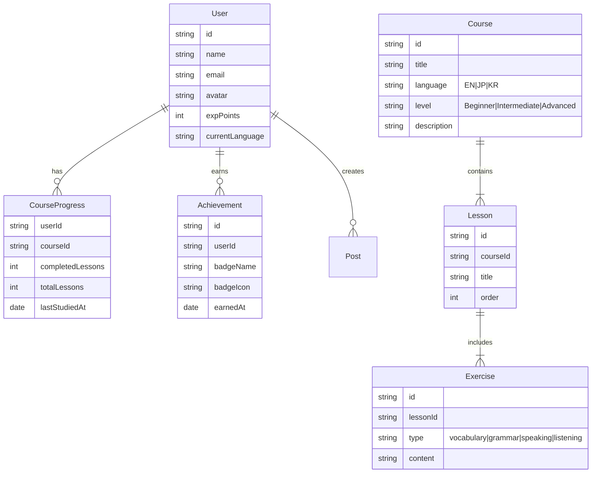

# 技术架构文档 (Technical Architecture)

## 1. 架构设计

## 2. 技术栈说明
- **前端框架**: React@18 (Vite)
- **样式方案**: Tailwind CSS v3
- **路由控制**: React Router v6
- **图标库**: Lucide React
- **图表库**: Recharts (用于学习进度与雷达图)
- **动画库**: Framer Motion (提供沉浸式的页面与答题交互)
- **模拟数据**: Mock.js 或静态 JSON 数据
- **状态管理**: Zustand 或 React Context (存储用户学习状态、当前语种等)

## 3. 路由定义
| 路由路径 | 用途说明 |
|-------|---------|
| `/` | 首页 (登陆前展示平台特性介绍，登录后重定向至仪表盘) |
| `/login` | 用户登录与注册页面 |
| `/dashboard` | 学习仪表盘 (今日推荐、总进度、最新成就) |
| `/courses` | 课程中心 (所有语种的课程大厅与搜索过滤) |
| `/courses/:id` | 课程详情页 (展示课程大纲与介绍) |
| `/learn/:lessonId` | 互动学习页面 (沉浸式的单词、语法、口语、听力训练) |
| `/community` | 学习社区 (分享心得、排行榜、发帖讨论) |
| `/profile` | 个人中心 (修改信息、查看完整成就与学习档案) |

## 4. 核心数据模型 (前端数据结构)
### 4.1 数据模型定义

## 5. 关键技术实现建议
1. **音频录制与比对 (口语跟读)**：利用 `MediaRecorder API` 录制音频波形，使用 `Web Audio API` 展示实时波形动画，模拟评分交互。
2. **多语种适配**：提取文案和课程内容为 JSON，通过自定义的 `i18n` Hook 实现界面和课程的多语种快速切换。
3. **性能优化**：对课程资源（特别是音频和图片）进行预加载，保障沉浸式体验中无明显的 Loading 感。
4. **响应式设计**：借助 Tailwind 的断点系统 (sm, md, lg)，确保仪表盘与学习组件在手机端也具备良好的可操作性。
