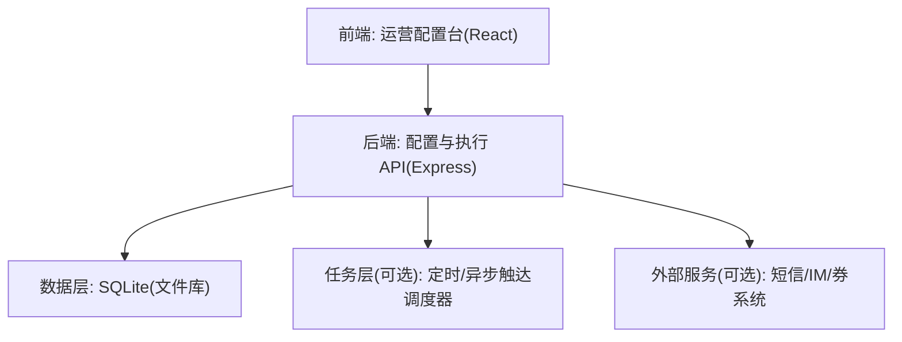
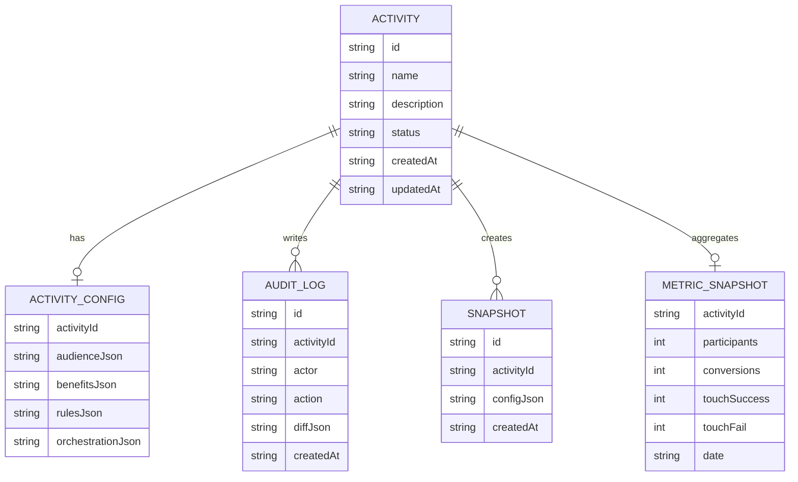

# 运营工具配置平台 技术架构

## 1. 架构设计
本项目按「前端配置台 + 后端配置与执行 API + 数据库 +（可选）异步任务」分层，先实现可跑通的 MVP：配置存储、校验、审计、触达模拟与数据看板。



## 2. 技术选型说明
- 前端：React@18 + TypeScript + Vite + Tailwind CSS + react-router-dom + zustand
- 后端：Express@4（ESM + TypeScript）
- 数据库：SQLite（MVP 以本地文件库落地，便于自包含与演示）
- 鉴权：MVP 使用本地账号/Token 模拟；后续可接企业 SSO
- 可视化规则：前端生成规则 AST(JSON) + 后端做结构校验与落库；执行侧先做「解释执行」的规则评估器
- 部署：单机一体化（MVP），后续可拆分前后端与任务调度

## 3. 路由定义（前端）
| Route | Purpose |
|-------|---------|
| /login | 登录与角色选择（MVP） |
| /activities | 活动列表与筛选 |
| /activities/:id | 活动总览（配置摘要/状态/风险提示） |
| /activities/:id/audience | 人群圈选（标签/行为/白名单） |
| /activities/:id/benefits | 权益配置（券包/积分/其他权益） |
| /activities/:id/rules | 规则引擎可视化配置 |
| /activities/:id/orchestration | 触达编排（渠道/AB/排期/频控） |
| /activities/:id/logs | 操作日志与快照对比 |
| /analytics | 效果数据看板 |

## 4. API 定义（后端）
### 4.1 通用约定
- 所有写接口写入操作日志并生成配置快照（活动维度）
- 上线状态下的配置变更默认禁止（需先下线或走变更流程）
- 请求/响应使用 JSON，时间统一使用 ISO8601 字符串

### 4.2 资源与接口（MVP）
#### 活动
- `GET /api/activities`：列表
- `POST /api/activities`：创建
- `GET /api/activities/:id`：详情（含配置摘要）
- `PATCH /api/activities/:id`：更新基础信息（名称、描述、时间窗）
- `POST /api/activities/:id/lifecycle`：状态流转（草稿/测试/上线/下线/归档）

#### 人群配置
- `PUT /api/activities/:id/audience`：保存人群定义
- `POST /api/activities/:id/audience/estimate`：人数预估（MVP 用 mock/规则解释器）
- `POST /api/activities/:id/audience/whitelist/import`：白名单导入（Excel 解析）

#### 权益配置
- `GET /api/benefits`：权益库列表
- `POST /api/benefits/coupon-packs`：创建券包
- `POST /api/benefits/points-rules`：创建积分规则
- `POST /api/activities/:id/benefits/bind`：活动绑定权益

#### 规则引擎
- `PUT /api/activities/:id/rules`：保存规则 AST
- `POST /api/rules/validate`：规则结构与冲突校验
- `POST /api/rules/evaluate`：对单用户样本做规则解释执行（用于测试）

#### 触达编排
- `PUT /api/activities/:id/orchestration`：保存编排配置
- `POST /api/activities/:id/dry-run`：测试触达（MVP 模拟发送与变量渲染）

#### 审计与看板
- `GET /api/activities/:id/audit-logs`：操作日志
- `GET /api/activities/:id/snapshots`：配置快照列表
- `POST /api/activities/:id/rollback`：回滚到快照
- `GET /api/analytics/overview`：全局概览
- `GET /api/analytics/activities/:id`：活动指标

### 4.3 TypeScript 类型（关键结构）
```ts
export type ActivityStatus = 'draft' | 'testing' | 'online' | 'offline' | 'archived'

export type ConditionOp =
  | 'eq'
  | 'neq'
  | 'in'
  | 'not_in'
  | 'gt'
  | 'gte'
  | 'lt'
  | 'lte'
  | 'between'
  | 'contains'
  | 'exists'

export type AtomicCondition = {
  field: string
  op: ConditionOp
  value?: unknown
  valueType: 'string' | 'number' | 'boolean' | 'date' | 'string[]' | 'number[]'
}

export type ConditionGroup = {
  logic: 'AND' | 'OR'
  not?: boolean
  children: Array<AtomicCondition | ConditionGroup>
}

export type AudienceDefinition = {
  labels?: ConditionGroup
  behaviors?: ConditionGroup
  whitelist?: { enabled: boolean; source: 'manual' | 'excel'; userIds: string[] }
}

export type RuleSet = {
  threshold?: ConditionGroup
  stacking?: { mode: 'exclusive' | 'allow'; priority?: number }
  limit?: { perUser: number; period: 'day' | 'week' | 'month' | 'lifecycle' }
}

export type TouchChannel = 'inbox' | 'sms' | 'im'

export type TouchStep = {
  id: string
  channel: TouchChannel
  templateId: string
  schedule: { type: 'immediate' | 'time_window' | 'cron'; value?: string }
  frequency: { maxPerUser: number; period: 'day' | 'week' | 'month' }
  ab?: { enabled: boolean; buckets: Array<{ name: string; ratio: number; templateId: string }> }
}

export type OrchestrationPlan = {
  steps: TouchStep[]
}
```

## 5. 服务端分层（后端）


## 6. 数据模型
### 6.1 ER 图（MVP）


### 6.2 DDL（MVP）
```sql
CREATE TABLE IF NOT EXISTS activities (
  id TEXT PRIMARY KEY,
  name TEXT NOT NULL,
  description TEXT NOT NULL DEFAULT '',
  status TEXT NOT NULL,
  created_at TEXT NOT NULL,
  updated_at TEXT NOT NULL
);

CREATE TABLE IF NOT EXISTS activity_configs (
  activity_id TEXT PRIMARY KEY,
  audience_json TEXT NOT NULL,
  benefits_json TEXT NOT NULL,
  rules_json TEXT NOT NULL,
  orchestration_json TEXT NOT NULL,
  FOREIGN KEY(activity_id) REFERENCES activities(id)
);

CREATE TABLE IF NOT EXISTS audit_logs (
  id TEXT PRIMARY KEY,
  activity_id TEXT NOT NULL,
  actor TEXT NOT NULL,
  action TEXT NOT NULL,
  diff_json TEXT NOT NULL,
  created_at TEXT NOT NULL,
  FOREIGN KEY(activity_id) REFERENCES activities(id)
);

CREATE TABLE IF NOT EXISTS snapshots (
  id TEXT PRIMARY KEY,
  activity_id TEXT NOT NULL,
  config_json TEXT NOT NULL,
  created_at TEXT NOT NULL,
  FOREIGN KEY(activity_id) REFERENCES activities(id)
);

CREATE TABLE IF NOT EXISTS metric_snapshots (
  activity_id TEXT NOT NULL,
  date TEXT NOT NULL,
  participants INTEGER NOT NULL DEFAULT 0,
  conversions INTEGER NOT NULL DEFAULT 0,
  touch_success INTEGER NOT NULL DEFAULT 0,
  touch_fail INTEGER NOT NULL DEFAULT 0,
  PRIMARY KEY(activity_id, date),
  FOREIGN KEY(activity_id) REFERENCES activities(id)
);

CREATE INDEX IF NOT EXISTS idx_audit_logs_activity_id_created_at ON audit_logs(activity_id, created_at);
CREATE INDEX IF NOT EXISTS idx_snapshots_activity_id_created_at ON snapshots(activity_id, created_at);
```

## 7. 关键实现要点（落地策略）
- 状态机：活动生命周期用后端单点校验，禁止非法流转（例如 online -> draft）
- 快照与回滚：每次写操作保存 config_json 快照，回滚生成一条审计记录并刷新配置
- 规则结构：前端输出 AST + 自然语言摘要；后端只信 AST 并强校验字段/类型/深度
- 导入：白名单导入采用「先解析校验 -> 预览 -> 提交写入」的两段式流程
- 触达：MVP 提供模拟发送与任务记录；真实渠道通过适配器接口接入（后续）

